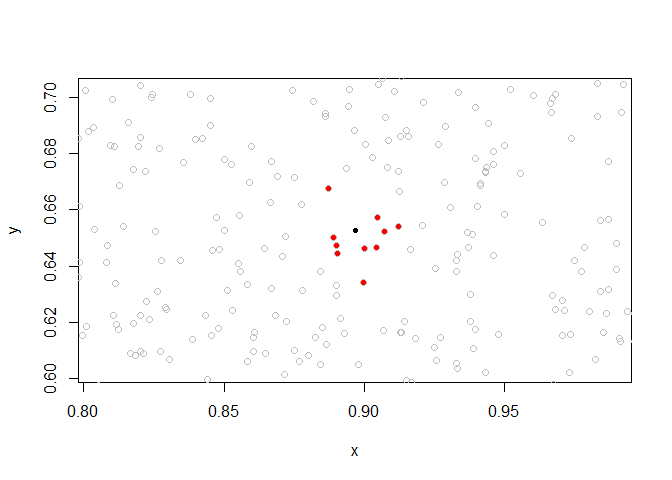
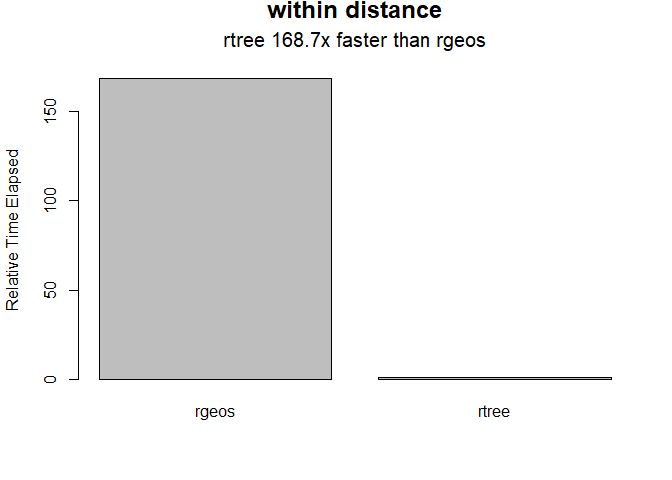
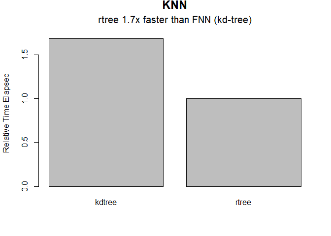

The rtree package offers fast Euclidean within-distance checks and KNN
calculations for points in 2D space. It offers significant speed-ups
vis-a-vis simple implementations by relying on the [R-tree data
structure](https://en.wikipedia.org/wiki/R-tree) implemented by the
[Boost
geometry](https://www.boost.org/doc/libs/1_75_0/libs/geometry/doc/html/geometry/spatial_indexes/introduction.html)
library.

rtree was inspired by
[this](http://gallery.rcpp.org/articles/Rtree-examples/) example in the
Rcpp gallery.

## Installation

``` r
# install.packages("remotes") # Install if needed
remotes::install_github("akoyabio/rtree")
```

Note: As of rtree version 0.2.0, rtree requires R version 4.0.0 or
higher. This is because version 1.75 of `boost::geometry` requires C++14
which is not well supported in R versions before 4.0.0.

## Usage

Say we have two large sets of points, A and B, stored as 2-column
matrices of Cartesian coordinates:

``` r
## Simulate point coordinates
set.seed(0)
A_n <- 10^4
A <- cbind(runif(A_n), runif(A_n))
B_n <- 10^4
B <- cbind(runif(B_n), runif(B_n))
colnames(A) <- colnames(B) <- c('x', 'y')
```

### Within-Distance Calculation

For each point of set *A*, *a*<sub>*i*</sub>, we want to know all points
of set *B* that are within distance *d* of *a*<sub>*i*</sub>. To compute
this, we first create an R-Tree index on *B*:

``` r
library(rtree)

## Set index
B_rtree <- RTree(B)
```

The RTree function creates an S3 object of class RTree,

``` r
inherits(B_rtree, 'RTree')
```

    ## [1] TRUE

which essentially just points to a C++ object of class RTreeCpp.

Using the RTree object, we can now perform our query efficiently:

``` r
## Within distance calculation
d <- 0.05
wd_ls <- withinDistance(B_rtree, A, d)
```

wd\_ls is a list of length nrow(A)…

``` r
nrow(A)==length(wd_ls)
```

    ## [1] TRUE

…whereby the *i*th list element contains the row-indices of the points
in *B* that are within distance *d* of point *a*<sub>*i*</sub>:

``` r
print(wd_ls[[1]])
```

    ##  [1] 9999 5736  819 2654 7768 8949 2849 5398 7940 1856  622 2151 5223 5964 6410
    ## [16] 3520 5320 2265 8569 3385 7011  246 4380 9875 9627 2508 6440 2678 4310 1207
    ## [31] 8408 4945 4402 6573  979 3394 8919 8232 7790 5144 2819 5167 6514 4973 5952
    ## [46] 8468 1283 7806  900 1277 1233  514 4225 7512 5313 8187 5626 4013 1661 9721
    ## [61] 4004  475 6321 1632 1772 6458 2379  686 1082 1629 1931 8422 8945  739 9470
    ## [76] 2515 1459 7517 1151 3991 3070 6498 5770 9752 7770

We can also check the sanity of the result visually:

``` r
## Plot points in B within distance d of point a_1
a_1 <- A[1,]  # Get coords of a_1
plot(a_1[1], a_1[2], xlim=c(a_1[1]-d, a_1[1]+d), ylim=c(a_1[2]-d, a_1[2]+d), 
     col='black', asp=1, pch=20, xlab='x', ylab='y')  # Plot a_1
points(B[,1], B[,2], col='grey')  # Plot B in grey
symbols(a_1[1], a_1[2], circles=d, add=TRUE, inches=FALSE)  # Draw circle of radius d
b_wd <- B[wd_ls[[1]],]  # Get relevant points in B
points(b_wd[,1], b_wd[,2], col='red', pch=20)  # Plot relevant points in red
```


### Nearest Neighbor Calculation

For each point of set *A*, *a*<sub>*i*</sub>, we want to know the *k*
points in B closest to *a*<sub>*i*</sub>. Recycling the RTree object
created above, we perform the knn computation…

``` r
## KNN calculation
k <- 10L
knn_ls <- knn(B_rtree, A, k)
```

…which returns a list of the same format as above, with the exception
that each element of knn\_ls is exactly of length *k*.

Again, we may plot the result to inspect its veracity:

``` r
## Plot points in B within distance d of point a_1
a_1 <- A[1,]  # Get coords of a_1
plot(a_1[1], a_1[2], xlim=c(a_1[1]-d, a_1[1]+d), ylim=c(a_1[2]-d, a_1[2]+d), 
     col='black', asp=1, pch=20, xlab='x', ylab='y')  # Plot a_1
points(B[,1], B[,2], col='grey')  # Plot B in grey
b_knn <- B[knn_ls[[1]],]  # Get relevant points in B
points(b_knn[,1], b_knn[,2], col='red', pch=20) # Plot relevant points in red
```



## Benchmarking

### Within-Distance Benchmarks

We first compare the within-distance functionality to the
`gWithinDistance()` function offered in
[rgeos](https://cran.r-project.org/package=rgeos) (version 0.5.5).

``` r
## Load packages
library(sp)
library(rgeos)
library(rbenchmark)

## Simulate data
set.seed(0)
A_n <- 10^3
A <- cbind(runif(A_n), runif(A_n))
B_n <- 10^3
B <- cbind(runif(B_n), runif(B_n))
d <- 0.05

## Encapsulate wd operations in functions, then benchmark
rgeos.wd <- function() {
  wd_mat <- gWithinDistance(spgeom1=SpatialPoints(A), spgeom2=SpatialPoints(B), 
                            dist=d, byid=TRUE)
}
rtree.wd <- function() {
  wd_ls <- withinDistance(RTree(B), A, d)
}
bm.wd <- benchmark(rtree=rtree.wd(),
                   rgeos=rgeos.wd(),
                   replications=10,
                   columns=c("test", "replications", "elapsed", "relative"))

## Print output
print(bm.wd)
```

    ##    test replications elapsed relative
    ## 2 rgeos           10    4.53      151
    ## 1 rtree           10    0.03        1

``` r
## Plot
barplot(bm.wd$relative, names.arg=bm.wd$test,
        ylab="Relative Time Elapsed", cex.main=1.5)
mtext("within distance", line=3, cex=1.5, font=2)
speedup <- round(bm.wd$relative[bm.wd$test=="rgeos"], 1)
mtext(paste("rtree ", speedup, "x faster than rgeos", sep=""), 
      line=1.5, cex=1.25)
```

<!-- -->

### KNN Benchmarks

Next we compare the KNN functionality with the KNN implementation based
on d-trees offered in the [FNN](https://cran.r-project.org/package=FNN)
package (version 1.1). We don’t offer benchmarking statistics against a
linear search KNN implementation, which would obviously be much, much
slower.

``` r
## Load packages
library(FNN)

## Simulate data
set.seed(0)
A_n <- 10^4
A <- cbind(runif(A_n), runif(A_n))
B_n <- 10^4
B <- cbind(runif(B_n), runif(B_n))
k <- 100L

## Encapsulate knn operations in functions, then benchmark
kdtree.knn <- function() {
  nn.idx <- get.knnx(data=B, query=A, k=k, algorithm=c("kd_tree"))
}
rtree.knn <- function() {
  nn_ls <- rtree::knn(RTree(B), A, k)
}
bm.knn <- benchmark(rtree=rtree.knn(),
                    kdtree=kdtree.knn(),
                    replications=10,
                    columns=c("test", "replications", "elapsed", "relative"))

## Print output
print(bm.knn)
```

    ##     test replications elapsed relative
    ## 2 kdtree           10    1.46    1.698
    ## 1  rtree           10    0.86    1.000

``` r
## Plot
barplot(bm.knn$relative, names.arg=bm.knn$test,
        ylab="Relative Time Elapsed", cex.main=1.5)
mtext("KNN", line=3, cex=1.5, font=2)
speedup <- round(bm.knn$relative[bm.knn$test=="kdtree"], 1)
mtext(paste("rtree ", speedup, "x faster than FNN (kd-tree)", sep=""), 
      line=1.5, cex=1.25)
```

<!-- -->
